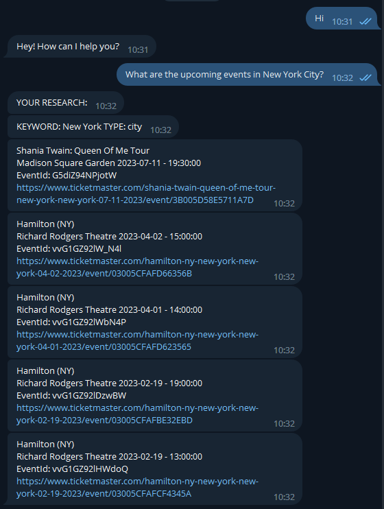
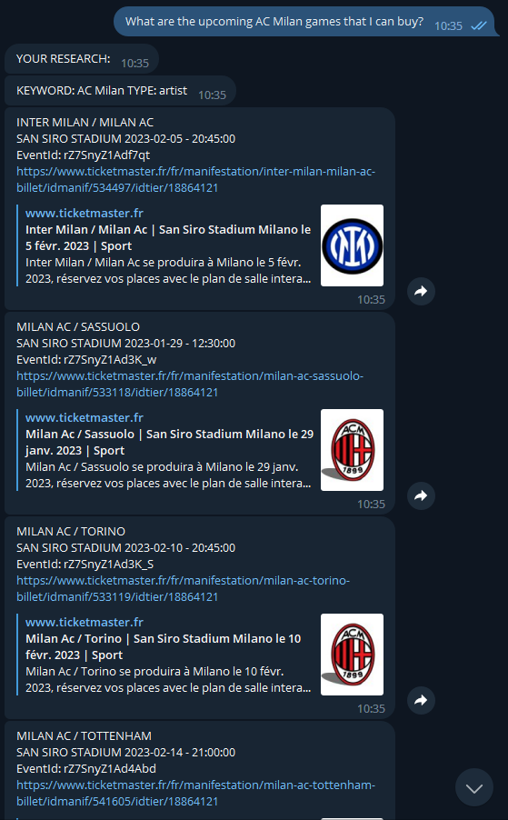
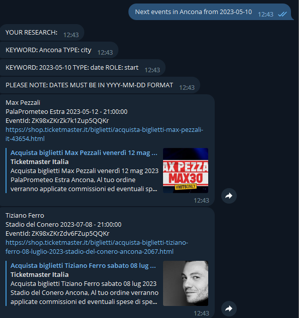
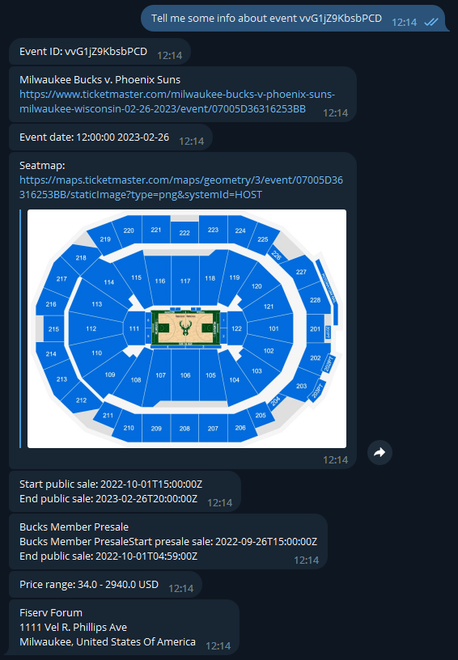
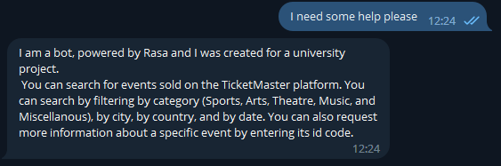
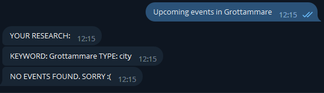

# TicketMaster Event Chatbot

This is a university project that implements a chatbot using the Rasa framework, that answers questions about events using the TicketMaster API. The chatbot also includes integration with Telegram.

### Getting Started

To run the chatbot, you will need to have Python and Rasa installed on your machine. You will also need to create a developer account with TicketMaster to obtain an API key.

API Key must be added in the **`actions/actions.py`** file for the calls to work properly.

Once you have all the necessary dependencies installed, you can clone this repository and run the following command to train the Rasa model:

```
rasa train
```

To run the Telegram integration, you will need to create a Telegram bot and add the bot token to the **`credentials.yml`** file. Then, you can run the following command to start the Telegram bot:

```
rasa run actions
rasa run
```

You can then start a conversation with the bot on Telegram and ask it questions about events.

Otherwise, to use the chatbot from the terminal, run the commands:

```
rasa run actions
rasa shell
```

### Queries

The chatbot allows you to search for events in different ways. You can search for events in a specific city, country, by keyword of the artist or sports team name, by category, and by date. Additionally, you can also combine search criteria, for example, searching for an artist in a specific city.

- **City**: To search for events in a specific city, you can ask the chatbot "What events are happening in [Paris]?"
- **Country**: To search for events in a specific country, you can ask the chatbot "What's the next events in [Italy]?"
- **Artist**: To search for events by keyword of the artist or sports team name, you can ask the chatbot "What concerts are there by [Ed Sheeran]?" or "What is the next match of [Real Madrid]?"
- **Category**: To search for events by category, you can ask the chatbot "Can you tell me about events in the [art] category?" The categories allowed are "arts", "theatre", "music", "sports", "miscellaneous".
- **Date**: To search for events by date, you can ask the chatbot "What are the events scheduled in [New York] from [2023-06-01] to [2023-06-30]?". **PLEASE NOTE:** The date must be in the format **`YYYY-MM-DD`**.

It's also possible to combine the queries, for example: "What events are happening with [artist/team name] in [city name]?"

Please note that the categories allowed are ("arts", "theatre", "music", "sports", "miscellaneous") and date must be in the format YYYY-MM-DD

### Screenshots

Include here screenshots of a sample conversation with the chatbot on Telegram.

Searching for events in a city



Searching events for a sports team



Searching events for a category


Searching events for a category



Get information about an event



Searching events for an artist in a country


Help request



Search without results



## **Built With**

- **[Rasa](https://rasa.com/)** - The open-source conversational AI framework used
- **[TicketMaster API](https://developer.ticketmaster.com/)** - Used to retrieve event information
- **[Telegram](https://telegram.org/)** - Used for the chatbot's messaging platform
